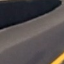

# Vehicle Detection Project
[](http://www.udacity.com/drive)


The goal of the project is to write a software pipeline to identify vehicles in a video from a front-facing camera on a car. It uses the Linear SVM classifier to train the classifer based on Histogram of Oriented Gradients (HOG), binned color, and color histograms as the training features, and implements a sliding-window technique to search for vehicles in video frames

---

# Implementation Deep Dive

## Training data set
The labelled training data of [vehicles](https://s3.amazonaws.com/udacity-sdc/Vehicle_Tracking/vehicles.zip) and [non-vehicles](https://s3.amazonaws.com/udacity-sdc/Vehicle_Tracking/non-vehicles.zip) is offered by Udacity from combination sources of the GTI vehicle image database and the KITTI vision benchmark suite. Here are examples of one of each of the `vehicle` and `non-vehicle` classes.

|Type|Sample Images for training|
|:---:|:---:|
|vehicles||
|not-vehicles||

## Training Features

## Histogram of Oriented Gradients (HOG)
HOG records the distribution ( histograms ) of directions of gradients ( oriented gradients ) in each image block. I used  `skimage.feature.hog` ([code](https://github.com/garygangwu/vehicle-detection/blob/master/feature_utils.py#L10)) to extract Histogram of Oriented Gradients (HOG).

Here are example in my training using the YCrCb color space and HOG parameters of orientations=9, pixels_per_cell=(8, 8) and cells_per_block=(2, 2).


### Binned color and histograms of color features
In addition to HOG, binned spatial features and histograms of color features are used in model training.

### Hyperparameter tuning
I tried various combinations of parameters, and finalized the parameters as below

|Type|Value|
|:---:|:---:|
|color space|YCrCb|
|HOG orientations|9|
|HOG pixels per cell|8|
|HOG cells per block|2|
|hog channel|ALL|
|spatial size| (32, 32)|
|Number of histogram bins|32|

## Train the Linear SVM Classifier

The training code is located in [train.py](https://github.com/garygangwu/vehicle-detection/blob/master/train.py) and [feature_utils.py](https://github.com/garygangwu/vehicle-detection/blob/master/feature_utils.py). 

1. Extracted features using hog features,  color spatial features, and histogram of color features for the car and not-car images
```
  car_features = extract_features(car_images, color_space, spatial_size, hist_bins, 
                                  orient, pix_per_cell, cell_per_block, hog_channel,
                                  spatial_feat=True, hist_feat=True, hog_feat=True)
  notcar_features = extract_features(notcar_images, color_space, spatial_size, hist_bins,
                                  orient, pix_per_cell, cell_per_block, hog_channel, 
                                  spatial_feat=True, hist_feat=True, hog_feat=True)
  X = np.vstack((car_features, notcar_features)).astype(np.float64)
  y = np.hstack((np.ones(len(car_features)), np.zeros(len(notcar_features))))
```

2. Normalize training feature with StandardScaler() function from Python's sklearn package
```
  X_scaler = StandardScaler().fit(X)
  scaled_X = X_scaler.transform(X)
```

3. Split the training and test data set
```
  rand_state = np.random.randint(0, 100)
  X_train, X_test, y_train, y_test = train_test_split(
      scaled_X, y, test_size=0.2, random_state=rand_state)
```

4. Training with LinearSVM classifier and evaluate the results
```
    svc = LinearSVC()
    svc.fit(X_train, y_train)
    accuracy = svc.score(X_test, y_test)
```

Next, I found the color space is one of most effective lever to improve the training accurancy. Among the color space explored, `YCrCb` is standed out with highest accurancy in the test results.

|Color Space|Test Accuracy|
|:---:|:---:|
|HSV|0.9850|
|LUV|0.9876|
|HLS|0.9819|
|YUV|0.9870|
|<b>YCrCb</b>|<b>0.9884</b>|

## Vehicle Detection

### Sliding Window Search
I break the image into 3 sections on Y axis: [400, 650], [400, 600], and [400, 550], which are corresponding to the `xy_window` of (128, 128), (96, 96), and (64, 64). `xy_overlap` is (0.75, 0.75), which means 75% overlap between neighbor sliding windows.


### Improve Detection Accurancy

1. To minimize the false positive, I filtered out the postive prediction with low confidence scores by calling `svc.decision_function`. Empirically, I set the threshold as 1.0.
```
def model_prediction(svc, test_features):
  scores = svc.decision_function(test_features)
  prediction = svc.predict(test_features)
  if prediction == 1:
    return scores[0] > PREDICTION_THRESH
  return 0
```

2. Detect hot windows
