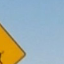
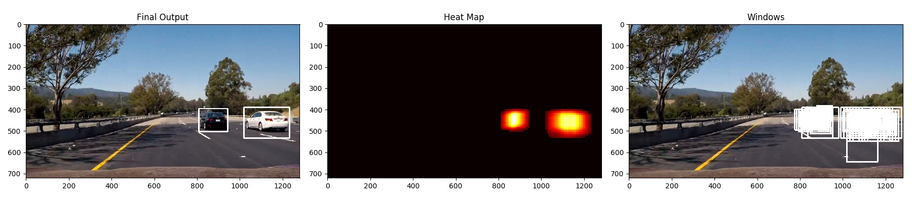

# Vehicle Detection Project
[](http://www.udacity.com/drive)


The goal of the project is to write a software pipeline to identify vehicles in a video from a front-facing camera on a car. It uses the Linear SVM classifier to train the classifer based on Histogram of Oriented Gradients (HOG), binned color, and color histograms as the training features, and implements a sliding-window technique to search for vehicles in video frames

---

# Implementation Deep Dive

## Training data set
The labelled training data of [vehicles](https://s3.amazonaws.com/udacity-sdc/Vehicle_Tracking/vehicles.zip) and [non-vehicles](https://s3.amazonaws.com/udacity-sdc/Vehicle_Tracking/non-vehicles.zip) is offered by Udacity from combination sources of the GTI vehicle image database and the KITTI vision benchmark suite. Here are examples of one of each of the `vehicle` and `non-vehicle` classes.

|Type|Sample Images for training|
|:---:|:---:|
|vehicles||
|not-vehicles||

## Training Features

## Histogram of Oriented Gradients (HOG)
HOG records the distribution ( histograms ) of directions of gradients ( oriented gradients ) in each image block. I used  `skimage.feature.hog` ([code](https://github.com/garygangwu/vehicle-detection/blob/master/feature_utils.py#L10)) to extract Histogram of Oriented Gradients (HOG).

Here are example in my training using the YCrCb color space and HOG parameters of orientations=9, pixels_per_cell=(8, 8) and cells_per_block=(2, 2).


### Binned color and histograms of color features
In addition to HOG, binned spatial features and histograms of color features are used in model training.

### Hyperparameter tuning
I tried various combinations of parameters, and finalized the parameters as below

|Type|Value|
|:---:|:---:|
|color space|YCrCb|
|HOG orientations|9|
|HOG pixels per cell|8|
|HOG cells per block|2|
|hog channel|ALL|
|spatial size| (32, 32)|
|Number of histogram bins|32|

## Train the Linear SVM Classifier

The training code is located in [train.py](https://github.com/garygangwu/vehicle-detection/blob/master/train.py) and [feature_utils.py](https://github.com/garygangwu/vehicle-detection/blob/master/feature_utils.py). 

1. Extracted features using hog features,  color spatial features, and histogram of color features for the car and not-car images
```
  car_features = extract_features(car_images, color_space, spatial_size, hist_bins, 
                                  orient, pix_per_cell, cell_per_block, hog_channel,
                                  spatial_feat=True, hist_feat=True, hog_feat=True)
  notcar_features = extract_features(notcar_images, color_space, spatial_size, hist_bins,
                                  orient, pix_per_cell, cell_per_block, hog_channel, 
                                  spatial_feat=True, hist_feat=True, hog_feat=True)
  X = np.vstack((car_features, notcar_features)).astype(np.float64)
  y = np.hstack((np.ones(len(car_features)), np.zeros(len(notcar_features))))
```

2. Normalize training feature with StandardScaler() function from Python's sklearn package
```
  X_scaler = StandardScaler().fit(X)
  scaled_X = X_scaler.transform(X)
```

3. Split the training and test data set
```
  rand_state = np.random.randint(0, 100)
  X_train, X_test, y_train, y_test = train_test_split(
      scaled_X, y, test_size=0.2, random_state=rand_state)
```

4. Training with LinearSVM classifier and evaluate the results
```
    svc = LinearSVC(C = 0.001)
    svc.fit(X_train, y_train)
    accuracy = svc.score(X_test, y_test)
```

Next, I found the color space is one of most effective lever to improve the training accurancy. Among the color space explored, `YCrCb` is standed out with highest accurancy in the test results.

|Color Space|Test Accuracy|
|:---:|:---:|
|HSV|0.9850|
|LUV|0.9876|
|HLS|0.9819|
|YUV|0.9870|
|<b>YCrCb</b>|<b>0.9884</b>|

## Vehicle Detection

### Detection pipeline

Here is a short summary of pipeline for car detection

* Use the sliding window technique to capture image windows for car detection
* Run the linear SVM classifier to check whether each image window is a car or not
* Generate the heatmap and apply the threashold to remove false positives
* Merge the overlapped detected window and draw the bounding boxes

### Sliding Window Search
I break the image into 4 sections on Y axis: [390, 650], [390, 650], [390, 550], and [360, 500], which are corresponding to the `xy_window` of (256, 256), (144, 144), (96, 96), and (72, 72). `xy_overlap` is (0.9, 0.9), which means 90% overlap between neighbor sliding windows.


### Improve Detection Accurancy

1. To minimize the false positive, I <b>filtered out the postive prediction with low confidence scores</b> by calling `svc.decision_function`. Empirically, I set the threshold as 1.0.
```
def model_prediction(svc, test_features):
  scores = svc.decision_function(test_features)
  prediction = svc.predict(test_features)
  if prediction == 1:
    return scores[0] > PREDICTION_THRESH
  return 0
```

2. <b>SVM C parameter Optimization:</b>
`C parameter` imforms the SVM optimization how much I want to avoid misclassifying each training example. It serves a trade-off between achieving a low training error at the train time vs. a low testing error on unseen data. To minimize the overfitting and avoid false postive, I picked a tiny C parameter, `0.001`, to impove the confidence of the prediction of the car images.

3. <b>Apply a high density of sliding windows:</b> It is unavoidable to have false postives, but the false postives are spontaneous. This means if moving the window a little bit, the detection algorithm will not new image window consider it as cars. However, if it is a really car, moving the window a little bit will still generate a postive prediction result. Therefore, with a high density of sliding windows, more windows will detect the acutal cars, while false postive windows are very limited. Empirically, I set the overlap window as 0.9, meaning 90% overlap between neighbor sliding windows. As a result, we can easily apply a high threadhold of overlapped the windows to indicate the true prediction. Below is an example that there is one false postive window but was removed applying an overlapped window threshold


4. <b>Apply the heatmaps and a high threashold:</b>
Heat-map is built to combine overlapping detections and remove false positives. To reject areas affected by false positives, I applied the threadhold of 8, which means at least 9 overlapped detected windows can be considered as the car areas.

```
  heatmap = np.zeros_like(image[:, :, 0])
  heatmap = add_heat(heatmap, hot_windows)
  heatmap = apply_threshold(heatmap, 8)
  heatmap = np.clip(heatmap, 0, 255)
  labels = label(heatmap)
  draw_img = draw_labeled_bboxes(np.copy(image), labels)
```

Here are examples of the dectected windows, heatmap, and the final output images.





5. <b>More training data:</b> To further get rid of the false positives, I have manually chop the images and generate more training data, both not-car and car images, from the course video. This helps the SVM training algorithm better recoganize the signals in the videos. Combining with initial data sets from Udacity, totally my training data contains 8877 cars and 10396 not-cars images.

---

## Video Implementation
The final video is available in [this github link (project_video.mp4)](https://github.com/garygangwu/vehicle-detection/blob/master/output_videos/project_video.mp4)

Here is [the youtube link](https://www.youtube.com/watch?v=5jJTe8nzIkI)

<a href="http://www.youtube.com/watch?feature=player_embedded&v=5jJTe8nzIkI" target="_blank"></a>


---

## Discussion

* The stability and tightness of the bounding boxes could have further improvements. It will require keeping exploration of hyperparameters or more training data to improve the prediction accurancy.
* The performance is a concern. Using SVM classifier takes a quite while for processing each image. The further performance tuning may be needed to apply this approach into the production. 
* Yolo v2 and Fast R-CNN are the most popular deep learning approaches for object detection. The performance is reasonable fast. So they might be better alternatives to the traditional SVM classifier.
