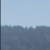

# Vehicle Detection Project

The goal of the project is to write a software pipeline to identify vehicles in a video from a front-facing camera on a car. It uses the Linear SVM classifier to train the classifer based on Histogram of Oriented Gradients (HOG), binned color, and color histograms as the training features, and implements a sliding-window technique to search for vehicles in video frames

---

# Implementation Deep Dive

## Training data set
The labelled training data of [vehicles](https://s3.amazonaws.com/udacity-sdc/Vehicle_Tracking/vehicles.zip) and [non-vehicles](https://s3.amazonaws.com/udacity-sdc/Vehicle_Tracking/non-vehicles.zip) is offered by Udacity from combination sources of the GTI vehicle image database and the KITTI vision benchmark suite. Here are examples of one of each of the `vehicle` and `non-vehicle` classes.

|Type|Sample Images for training|
|:---:|:---:|
|vehicles||
|not-vehicles||

### Histogram of Oriented Gradients (HOG)
HOG records the distribution ( histograms ) of directions of gradients ( oriented gradients ) in each image block. I used  `skimage.feature.hog` ([code](https://github.com/garygangwu/vehicle-detection/blob/master/feature_utils.py#L10)) to extract Histogram of Oriented Gradients (HOG).

Here are example in my training using the YCrCb color space and HOG parameters of orientations=9, pixels_per_cell=(8, 8) and cells_per_block=(2, 2).

### Binned color and histograms of color features
In addition to HOG, binned spatial features and histograms of color features are used in model training.

### Hyperparameter tuning
I tried various combinations of parameters, and finalized the parameters as below

|Type|Value|
|:---:|:---:|
|color space|YCrCb|
|HOG orientations|9|
|HOG pixels per cell|8|
|HOG cells per block|2|
|hog channel|ALL|
|spatial size| (32, 32)|
|Number of histogram bins|32|

In addition, I found the color space is one of most effective lever to improve the training accurancy. Among the color space explored, `YCrCb` is standed out with highest accurancy in the test results.

|Color Space|Test Accuracy|
|:---:|:---:|
|HSV|0.9850|
|LUV|0.9876|
|HLS|0.9819|
|YUV|0.9870|
|<b>YCrCb</b>|<b>0.9884</b>|

The training code is located in [train.py](https://github.com/garygangwu/vehicle-detection/blob/master/train.py) and [feature_utils.py](https://github.com/garygangwu/vehicle-detection/blob/master/feature_utils.py). 
